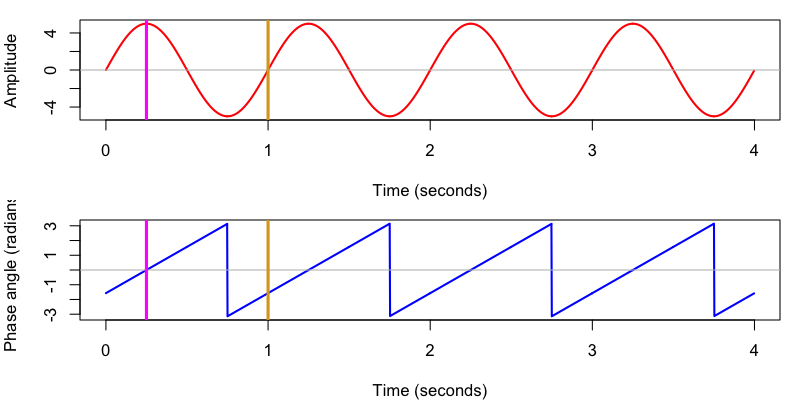

# Analyzing human sleep EEG: a methodological primer with code implementation

Drs. Roy Cox and Juergen Fell recently published an excellent
review/tutorial
[manuscript](https://doi.org/10.1016/j.smrv.2020.101353) in _Sleep
Medicine Reviews_, providing a useful overview of some common
approaches -- _and associated pitfalls_ -- for the analysis of sleep
EEG data.  Of note, the authors also provided open data and Matlab
code, thereby enabling readers to reproduce and better understand the
methods.

> Cox R & Fell J (2020) Analyzing human sleep EEG: A methodological
> primer with code implementation, _Sleep Medicine Reviews_. 
> [https://doi.org/10.1016/j.smrv.2020.101353](https://doi.org/10.1016/j.smrv.2020.101353)

In the vignette below (co-authored with Dr. Roy Cox), we'll use Luna
to look at the data from this manuscript (labelled _C&F_),
attempting to reproduce some of the key Figures.  By comparison
against the transparent Matlab code _C&F_ provide, our intention here
is to 1) illustrate using Luna in the context of high-density sleep
EEG data, and 2) hopefully cast a little light onto the admittedly
_black box_ nature of various Luna commands.  A strong theme of _C&F_
is to point out the ways in which seemingly minor methodolgocial
differences can have marked effects on the results of analyses: in
this spirit, we step through some of these methods and try to make
Luna's particular implementation clear, as well as validating our
results against _C&F's_ standard.

!!! Info "Scope of this vignette"
    We do not attempt to cover all
    aspects of _C&F_ in this vignette (for example, the discussion of
    statistical hypothesis testing, or any in-depth consideration of
    the impact of reference choice). Furthermore, this
    vignette is not intended to be a guide to _best practices_ when
    working with sleep data.  Rather, here we have a more limited goal
    of simply making connections between quite different software
    implementations (arguably, each with their own strengths and
    weaknesses) that can hopefully achieve comparable results.

## Data

_C&F_ provided EEG recordings (each comprising 58 EEG channels) on
three individuals, for both N2 and N3 sleep, using three referencing
schemes: linked mastoids, the common average and surface Laplacian.
The original 18 (i.e. 3 x 2 x 3) datasets are distributed by _C&F_ in
Matlab/EEGLAB format (available
[here](https://zenodo.org/record/3929730#.XyAQ3S-z3dc)).  As Luna
primarily works with EDFs, we've converted these data to EDF and
posted them on the [NSRR](http://sleepdata.org).  To follow the tutorial below, you should
download these EDFs, which are split into three archives according to
the reference used.  As almost all of this tutorial uses the linked
mastoid versions of the data, you can start by only downloading the
first one (linked mastoid reference):

| Archive | Contents | Filename |
| ---- | ---- | ---- |
| Linked mastoid EDFs (__primary__) | 6 EDFs (3 individuals for N2 & N3) | [`cox_fell_edfs_mast.zip`](https://sleepdata.org/datasets/coxfell2020/files/m/browser/cox_fell_edfs_mast.zip) |
| Common average EDFs  | 6 EDFs (3 individuals for N2 & N3)  | [`cox_fell_edfs_ave.zip`](https://sleepdata.org/datasets/coxfell2020/files/m/browser/cox_fell_edfs_ave.zip) |
| Surface Laplacian EDFs  | 6 EDFs (3 individuals for N2 & N3) | [`cox_fell_edfs_lap.zip`](http://zzz.bwh.harvard.edu/dist/luna/cf/cox_fell_edfs_lap.zip) - _not posted_ |

After downloading the zip archive to your working directory, extracting the contents should generate a subfolder `edfs` containing six EDFs:
```
unzip cox_fell_edfs_mast.zip
```

## Code

_C&F_ provide Matlab code to reproduce all of the Figures in their
manuscript; for convenience, _C&F's_ Matlab code (version released
2020-07-03) is copied [here](../img/cf/matlab.html) (separate from
the original data files). For brevity, in the examples below we only show some of the primary
Matlab commands: in order to fully follow _C&F's_ workflow, you'll need to run
the entire scripts (and see the `readMe.txt` in the code folder).  Each section
below links to the original, full version of each script.

In particular, below we consider the following, starting simple and
then building up to more sophisticated analyses, includng empirical,
surrogate-based coupling and connectivity analyses:

 - Looking at raw signal data 
 - Spectral analysis using the DFT, the Welch algorithm and topographical visualization
 - Examples of applying Hilbert and wavelet transformations
 - Phase-amplitude coupling (dPAC) analysis using surrogate time-series
 - Connectivity analysis with weighted Phase Lag Index (wPLI), using surrogate time-series

Each section focuses on reproducing Figures and results from _C&F_ as
closely as possible.  We do not explain the commands or methods in
detail -- the _C&F_ manuscript does a good job of that, as well as
pointing to the relevant core literature.  Rather, our aim is to implement
some of the methods described using Luna, with a focus on better understanding
any differences in implementations.  

In a future, follow-up vignette, we will go on to use these data to
explore other Luna commands including areas not covered by _C&F_:
e.g. the impact of filter choice, other connectivity metrics,
multi-channel artifact detection and interpolation, and time-series
clustering to reveal epoch-level dynamics and channel-level
substructure.  _Stay tuned..._

In the text below, Matlab code and Figures taken (with the authors'
permission) directly from _C&F_ are shown in purple boxes like this:

!!! Example "e.g. _C&F_ Matlab code or Figure"    
    ```
    %load data
    EEG=pop_loadset([dataFolder subName filesep subName '_N3_mast.set']);
    ```

In contrast, Luna commands (entered via the terminal/command-line),
any [R](http://r-project.org) statements, as well as any output, are
listed as follows:

```
luna s.lst -o o.db -s HEADERS
```

Note that this vignette is structured for didactic purposes --
exposing some of the underlying methods implemented in Luna including
FFT, filter-Hilbert and wavelet methods -- rather than for showing typical
_best practices_ in how to use Luna.  That is, below we'll write signals
to files on disk, and use fairly 'low level' commands such as `CWT`
and `HILBERT`, which would not typically be done in practice.  Rather,
those types of commands are wrapped into higher-level commands (such as
`SPINDLES` or `CC`, etc).  _That is, if this is your first exposure to
Luna, you'll get a better sense of the general workflows by following
the [tutorials](../tut/tut1.md)_.  Also note that version Luna __v0.24__
is required to be able to follow all of the examples below.

## Setting up

To generate a Luna [_sample-list_](../luna/args.md#sample-lists), use the [`--build`](../luna/args.md#-build-option) command:

```
luna --build edfs/ > s.lst
```

The file `s.lst` is a simple text file, with six rows corresponding to the six EDFs.  We can examine the contents of the EDFs via the `DESC` command,
here applied just to the first EDF (row of `s.lst`):

```
luna s.lst 1 -s DESC
```
```
EDF filename      : ./edfs/pp1_N2_mast.edf
ID                : pp1_N2_mast
Clock time        : 13.11.05 - 14.42.05
Duration          : 01.31.00
# signals         : 59
Signals           : Fp2[400] Fp1[400] AF8[400] AF4[400] AFz[400] AF3[400]
                    AF7[400] F8[400] F6[400] F4[400] F2[400] Fz[400]
                    F1[400] F3[400] F5[400] F7[400] FC6[400] FC4[400]
                    FC2[400] FCz[400] FC1[400] FC3[400] FC5[400] T8[400]
                    C6[400] C4[400] C2[400] Cz[400] C1[400] C3[400]
                    C5[400] T7[400] TP8[400] CP6[400] CP4[400] CP2[400]
                    CPz[400] CP1[400] CP3[400] CP5[400] TP7[400] P8[400]
                    P6[400] P4[400] P2[400] Pz[400] P1[400] P3[400]
                    P5[400] P7[400] PO8[400] PO4[400] POz[400] PO3[400]
                    PO7[400] O2[400] Oz[400] O1[400] Status[400]
```

As made evident by the ID, this EDF contains data on the first individual
(`pp1`), for N2 sleep using a linked mastoid referencing scheme. There
are 58 EEG channels (plus a `Status` channel which we will ignore),
each with a sampling rate of 400 Hz.

!!! hint
    Instead of using a number to indicate a row of the sample list, you can also specify an individual by their ID:
    ```
    luna s.lst pp1_N2_mast -s DESC
    ```
    See the [main documentation](../luna/args.md) for more details.


## Extracting raw signals

In Supplementary Figure A-1B, _C&F_ take a 20-second epoch of data,
plot the raw signal, and subsequently apply spectral analysis.  They
use linked mastoid N3 data from subject `pp3`, selecting a 20-second
window (from 1660 to 1680 seconds from the start of the EDF) of the
`Cz` channel.  Here are script excerpts used to
[setup](../img/cf/matlab.html#setup) and
[load](../img/cf/matlab.html#load_data) these data; _C&F_ plot the signal
as below:

!!! Example "C&F Supplementary Figure A-1 (B) : illustrative 20-seconds of raw sleep EEG (Cz)"
    {width="100%"}

Using Luna to achieve the same goal, we will first extract the raw
signal to a text file (`cz.txt`) and then use R to plot it.  Here we a) set 20-second `EPOCH`s, b)
`MASK` all epochs that do not span the interval 1660-1680 seconds, and then c) write this signal to a file,
using the `MATRIX` command:
```
luna s.lst pp3_N3_mast -s 'EPOCH dur=20 & 
                           MASK sec=1660-1680 & 
                           MATRIX sig=Cz minimal file=cz.txt'
```

Because the default epoch length is 30 seconds in Luna, we had to
explicitly tell it to use 20-second instead.  Then, from within R, for
example, we can generate a simple plot:

```
plot( (1:8000/400), scan( "cz.txt" ),
      type = "l", ylab = "Cz", xlab = "Seconds", col="darkorange" )
```

{width="100%"}


!!! hint "Alternatively: using lunaR" 
    To simplify matters in this vignette, we are not going to use the [_lunaR_](../ext/R/index.md) package: instead, we will swap
    between command-line luna ([_lunaC_](../luna/args.md)) and the R package for any visualization, as above.  However, all the steps performed
    here could be performed using only _lunaR_ if so desired, and in some instances this could be simpler/preferrable. For example: here we attach the correct EDF, extract
    a data-frame `d` that corresponds to 20-seconds of `Cz`, and then plot it:
    ```
    library(luna)
    sl <- lsl( "s.lst" )
    lattach( sl , "pp3_N3_mast" )
    d <- ldata.intervals( chs = "Cz" , i = list( c( 1660 , 1680 ) ) ) 
    plot( d$SEC , d$Cz , type="l" , ylab="Cz" , xlab="Seconds" , col="darkorange" ) 
    ```

## Spectral analyses

Following _C&F_, we next consider spectral analysis using the discrete
Fourier transform (DFT) (implemented using the fast Fourier transform,
FFT) first on a simulated signal, then on the above interval of real
EEG data (20-seconds of Cz from N3).  We'll then use the Welch method
(rather than raw DFT) to estimate a better PSD spectrum.

### Simulated data

!!! hint
    If you're familiar with DFT/FFT basics skip this section, which purposefully duplicates the introductory example material in _C&F_.  Skip ahead
    to where we [use Luna to do DFT/FFT on real sleep signals](#fft-of-real-data)

_C&F_ generated a simple, simulated signal using
[this](../img/cf/matlab.html#simulate1) code, and then applied [this
code](../img/cf/matlab.html#fft_sim), invoking Matlab's `fft()` function
to estimate the (normalized) amplitude spectrum of this signal: the key lines are copied below:

!!! Example "powerDefined.m excerpt : _estimating the amplitude spectrum of simulated data_" 
    ```
    %fft function does not return actual frequencies, so compute
    sineFreqs_fft=linspace(0,1,numSamplesSine/2+1)*NyLimit;

    %perform fft
    sineFft_twoSided=fft(sineWaves); %complex-valued, two-sided Fourier spectrum

    %for single-sided spectrum, we take first half of results (positive
    %frequencies), plus 1 for DC
    sineFft_oneSided=sineFft_twoSided(1:numSamplesSine/2+1);

    %non-normalized amplitude spectrum
    sineAmp_oneSided=abs(sineFft_oneSided);

    %normalized spectrum (by data length, and multiplied by two include
    %negative frequencies)
    sineAmpNorm_oneSided=2*sineAmp_oneSided/numSamplesSine;
    ```

They plot the simulated signal, which has sinusoidal oscillations at 1 and 13 Hz, along with the normalized amplitude
(`sineAmpNorm_oneSided`):

!!! Example "C&F Supplementary Figure A-1 (A, F) : simulated signal and amplitude from DFT/FFT analysis"
    {width="100%"}


Here, we'll repeat these steps, but first using R to generate the simulated signal, writing it to a text file `s1.txt`:

```
sRate <- 400
sPeriod <- 1 / sRate
sineLength <- 5
sineTime <- seq(0 , by = sPeriod , length.out = sineLength * sRate )

# SO-like sine
sineFreq_1 <- 1
sineAmp_1 <- 50
sineWave_1 <- sineAmp_1 * sin( 2 * pi * sineFreq_1 * sineTime)

# spindle-like sine
sineFreq_2 <- 13
sineAmp_2 <- 10
sineWave_2 <- sineAmp_2 * sin( 2 * pi * sineFreq_2 * sineTime)

sineWaves <- sineWave_1 + sineWave_2
plot( sineTime , sineWaves , type="l" ) 
write( format( sineWaves , digits=20 ) , file="s1.txt" , ncolumns = 1 )
```

{width="100%"}

That is, `s1.txt` contains a signal 5 seconds in duration, sampled at
400 Hz (i.e. 2000 data points). It comprises a single signal that is a
composite of a slow 1 Hz sinusoidal oscillation of large amplitude
(50) and a faster 13 Hz oscillation of relatively smaller amplitude
(10).

We can now perform the same DFT/FFT analysis using Luna.  Although the DFT/FFT is
core to many methods, in practice Luna uses Welch's algorithm (in [`PSD`](../ref/power-spectra/#psd)) or
multi-tapers (in [`MTM`](../ref/power-spectra/#mtm)), either of which are generally superior for
sleep EEG data, as _C&F_ note. 

For the purpose of this vignette however, we shall uncover a _hidden_
Luna option (actually an internal, debugging feature), which provides
direct access to the FFT algorithm via the `-d` option, albeit
applying it only to a single signal read from standard input. (The
[`FFT`](../ref/power-spectra.md#fft) command does the same for EDF
signals.)  From the section above, we've already written the signal to
the file `s1.txt`, and so we can run the following, where the second
parameter is the sample rate, 400 Hz:

```
luna -d fft 400 < s1.txt 
```
```
N        F           RE            IM   UNNORM_AMP     NORM_AMP          PSD
0        0  -8.8543e-13             0   8.8543e-13  4.42715e-16  9.79982e-31
1      0.2 -1.37534e-12  -3.51501e-13  1.41955e-12  1.41955e-15  5.03781e-30
2      0.4 -9.66871e-13  -8.34902e-13  1.27746e-12  1.27746e-15  4.07975e-30
3      0.6 -1.27042e-12   1.66038e-12  2.09066e-12  2.09066e-15  1.09271e-29
4      0.8 -1.50445e-12   1.66702e-12  2.24552e-12  2.24552e-15  1.26059e-29
5        1 -1.23403e-11        -50000        50000           50         6250
6      1.2  1.90059e-12  -6.63079e-12  6.89779e-12  6.89779e-15  1.18949e-28
7      1.4  3.44644e-12  -3.94652e-12  5.23955e-12  5.23955e-15  6.86323e-29
...
63    12.6  2.03742e-12  -2.06926e-11  2.07926e-11  2.07926e-14  1.08083e-27
64    12.8 -8.86146e-14  -4.31716e-11  4.31717e-11  4.31717e-14  4.65949e-27
65      13  1.40656e-10        -10000        10000           10          250
66    13.2  7.86557e-13   4.58913e-11   4.5898e-11   4.5898e-14  5.26657e-27
67    13.4  1.78749e-12   2.01059e-11  2.01852e-11  2.01852e-14  1.01861e-27
...
997  199.4   1.1755e-12  -4.71233e-12  4.85673e-12  4.85673e-15  5.89696e-29
998  199.6 -9.80151e-13  -3.55298e-12  3.68569e-12  3.68569e-15  3.39608e-29
999  199.8  3.88777e-13   4.94795e-12   4.9632e-12   4.9632e-15  6.15834e-29
1000   200  2.47011e-12  -5.04871e-28  2.47011e-12  2.47011e-15  7.62679e-30
```

This outputs 1,	001 rows (plus a header), showing a single side of the
symmetric DFT (i.e. ignoring negative frequencies which, as the input data
are real-valued, are redundant).

Column `F` (`sineFreqs_fft` in the Matlab code) contains the
frequencies, ranging from 0 (DC) to 200 (the Nyquist frequency,
i.e. half the sampling rate).  The difference between each frequency
(i.e. the spectral resolution) is 0.2 Hz (i.e. which equals the
sampling rate over the number of sample points in the DFT, 400/2000).

The columns `RE` and `IM` are the real and imaginary parts of the Fourier transform, which
correspond to the complex-valued `sineFft_twoSided` in the Matlab code.

The column `UNNORM_AMP` is the unnormalized amplitude of the Fourier
transform (`sineAmp_oneSided` in the Matlab code): this is the
absolute value of the corresponding complex number.

The column `NORM_AMP` (`sineAmpNorm_oneSided` in the Matlab code) is
the amplitude normalized by dividing by 2000 (the number of data
points) and, for non-DC components, multiplying by a factor of 2 (to
correctly scale after ignoring the negative frequency side of the
spectrum).

Most values are very small (i.e. due to trivial numerical
imprecisions) and are effectively 0, as would be expected for this
simulated signal.  Only for 1 Hz and 13 Hz frequency bins do we see
substantial non-zero values.  Note, the normalized amplitudes are 50
and 10 for the 1 Hz and 13 Hz frequency components respectively, which
mirror the original values used in the simulation code (`sineAmp_1`
and `sineAmp_2`).

Finally, Luna also outputs the power spectral density (PSD), which has
units of micro-volts squared per Hz.  To obtain this we instead i)
square the original, unnormalized amplitude, ii) double all non-DC
points and then iii) normalize by the sampling frequency as well as
the number of sample points _1/Fs.N_ (i.e. dividing by 400 * 2000 =
800,000) to get the PSD, which gives values of 6250 and 250 for 1 Hz
and 13 Hz, respectively.

Contrasting with _C&F_, we see similar results.  If the above output had been saved to the file `out/sim.fft`,
we can make the same plot of the normalized amplitude spectrum:

```
d <- read.table( "out/sim.fft" , header = T ) 

plot( d$F[ d$F <= 30 ] , d$NORM_AMP[ d$F <= 30 ] , type="l" ,
      col="darkgreen" , xlab="Frequency (Hz)" , ylab="Normalized amplitude" ) 
```

{width="100%"}


### FFT of real data

_C&F_ next apply DFT to the 20-second interval of real data extracted above (i.e. Figure A-1), using the same
basic code as above (see [here](../img/cf/matlab.html#fft_data)), resulting in the following PSD spectrum (left panel):

!!! Example "C&F Supplementary Figure A-1 (G,H) : estimating PSD spectra with raw DFT/FFT and Welch's method"
    {width="100%"}

We can use the same `-d fft` option, but feeding in the `cz.txt` channel generated earlier:

```
luna -d fft 400 < cz.txt > out/fft.out
```

Plotting the spectrum, the results are identical to the Matlab code
(nb. only showing amplitude and PSD, not power):

```
fft <- read.table( "out/fft.out" , header = T ) 

plot( fft$F ,log10( fft$PSD ) , type="l" , xlim=c(0,30) , ylim=c(-5,3) ,
      col="blue" , ylab="amplitude (green) / PSD (blue)" , xlab="Freq (Hz)" ) 

lines( fft$F ,log10( fft$NORM_AMP ) , type="l" ,
       xlim=c(0,30) , ylim=c(-5,3) , col="darkgreen" )

```
{width="100%"}


### Welch algorithm

The plot of the Figure A-1 H (shown above) in _C&F_ gives the PSD
spectra estimated using Welch's method, cutting up the signal into
small, overlapping chunks and averaging PSD over these chunks to
provide a more reliable final result, which has lower spectral
resolution, but reduced variance of the estimates.   [This](../img/cf/matlab.html#welch30) is the code they use for the
20-second segment; and [this](../img/cf/matlab.html#welch_all) for
the entire Cz channel (all N3 for this individual).

Here we'll apply Luna's default `PSD` command (which implements Welch's method) on the
same 20-second segment, working directly with the EDF and saving the output in a Luna-format [database](../luna/args.md#output) (with
the `-o` option):
```
luna s.lst pp3_N3_mast
     -o out/welch.db 
     -s 'EPOCH dur=20 & 
         MASK sec=1660-1680 & RE & 
         PSD sig=Cz spectrum'
```
To view the results, we use the [`destrat`](../luna/destrat.md) utility that accompanies Luna (only showing the relevant rows here):
```
destrat out/welch.db
```
```
--------------------------------------------------------------------------------
distinct strata group(s):
  commands      : factors           : levels        : variables 
----------------:-------------------:---------------:---------------------------
                :                   :               : 
  [PSD]         : F CH              : 99 level(s)   : PSD
                :                   :               : 
  [PSD]         : B CH              : 8 level(s)    : PSD RELPSD
                :                   :               : 
----------------:-------------------:---------------:---------------------------
```
That is, amongst other things, the output database contains a variable `PSD` stratified by both frequency `F` and channel `CH`, which corresponds to
the spectrum for Cz.  We can view this output as follows:
```
destrat out/welch.db +PSD -r F CH 
```
```
ID             CH     F      PSD
pp3_N3_mast    Cz     0.5    407.176141081321
pp3_N3_mast    Cz     0.75   365.011219296792
pp3_N3_mast    Cz     1      312.329794883209
pp3_N3_mast    Cz     1.25   166.992808840289
pp3_N3_mast    Cz     1.5    64.7901538256349
pp3_N3_mast    Cz     1.75   68.330452921674
pp3_N3_mast    Cz     2      39.6088857305875
...
```

Below we plot these values (e.g. using R's `plot()` function as above, in red), but 
superimposed on the results obtained from running the _C&F_ code (in gray) for
this 20-second segment, plotting the log-scaled PSD:

{width="100%"}

That is, the gray line is the original Matlab output from `pwelch()`, whereas
the red is the output from Luna's default `PSD` command.  We can see
pretty close alignment between the two sets of estimates, but not
complete.  These differences reflect differences in how the two methods
are parameterized/fine-tuned: for didactic purposes, we'll step through these
here, and see whether we're able to reproduce an _identical_ version of the
Matlab results.

First, we see that the Luna output only ranges from 0.5 Hz to 25 Hz; in contrast,
the Matlab output gives the full
spectrum, from 0 to 200 Hz (although we only plot up to 30 Hz).  This
difference in the range of the frequencies output is a trivial
consequence of Luna's default, which by default truncate output at these values.  These
defaults can be changed easily, by adding the options `min=0
max=30`, i.e.  to get all values between 0 and 30 Hz.

There is another difference in the frequencies, however: the Luna
outputs frequencies in steps of 0.25 Hz, whereas the Matlab code is in
steps of 0.1953 Hz (i.e. the _spectral resolution_):

```
ID            CH   F      PSD
pp3_N3_mast   Cz   0.5    407.176141081321
pp3_N3_mast   Cz   0.75   365.011219296792
pp3_N3_mast   Cz   1      312.329794883209
pp3_N3_mast   Cz   1.25   166.992808840289
pp3_N3_mast   Cz   1.5    64.7901538256349
pp3_N3_mast   Cz   1.75   68.330452921674
pp3_N3_mast   Cz   2      39.6088857305875
...
```

There are two reasons for this difference.

First, by default, Luna uses __4-second segments__ with 50%
(i.e. 2-second) overlap, whereas the Matlab code used __5-second
segments__ (also with 50%, i.e. 2.5-second overlap).  Both are
reasonable options and will typically give similar (albeit not
identical) results; we can change the segment size (and overlap) with
the `segment-sec` and `segment-overlap` options.  The spectral
resolution is given by the sampling rate (400 Hz) divided by the size
of the FFT (i.e. of 1600 datapoints). For 4 seconds, this gives 400 /
( 4 * 400 ) = 0.25 Hz, as we observed in the Luna output.

In contrast, _C&F_ used a 5-second segment size for each FFT, which
following the logic above would yield a frequency resolution of 0.2
Hz, i.e. 400 / ( 5 * 400 ).  However, the Matlab code gives a slightly
different value, 0.1953 Hz.  This reflects yet another small
difference in implementations.  By default, the `pwelch()` does _not_
apply an FFT of size 5 * 400 = 2000 sample-points, but instead will
use the next highest power of 2, namely 2048 (2^11).  This is done
purely for computational reasons, as (for highly technical reasons)
the FFT algorithm is optimized for inputs that are a power of 2.
Internally, the `pwelch()` command will _pad_ the input, by adding
zeros at the end of the signal (i.e. 48 zeros in this case).  This
will not fundamentally change the analysis, but it will change the
spectral resolution and therefore the size of the frequency bins of the transform.
In this instance, we have 400 / 2048 = 0.1953 Hz.  For comparability,
we can force Luna to also zero-pad up to the next power of 2, by
adding the `pow2` option to `PSD`.

So, let's try again, repeating the above command but with these additional options:

```
luna s.lst pp3_N3_mast
     -o out/welch.db
     -s 'EPOCH dur=20 &
         MASK sec=1660-1680 & RE &
         PSD sig=Cz spectrum
             segment-sec=5 segment-overlap=2.5 min=0 max=30 pow2 '

```
{width="100%"}

This is closer.  We now see that the Luna output has the same spectral resolution as the Matlab code, of 0.1953 Hz.
```
       F        PSD
0.000000   2.711244
0.195312  16.079487
0.390625 215.816172
0.585938 422.248449
0.781250 313.669716
0.976562 301.519550
...
```

As we see above, however, the lines still do not overlap completely.
This is due to yet another small difference in the behavior of
these routines.  By default, `pwelch()` applies a Hamming window to
each (5-second) segment, to avoid edge artifacts in the FFT.  Luna
uses a 50%-Tukey window by default, however.  Again, both are
reasonable options, and likely to give comparable results under most
circumstances.  We can make Luna use a Hamming window instead, by adding the
`hamming` option:

```
luna s.lst pp3_N3_mast
     -o out/welch.db
     -s 'EPOCH dur=20 &
         MASK sec=1660-1680 & RE &
         PSD sig=Cz spectrum segment-sec=5 segment-overlap=2.5
             min=0 max=30 pow2 hamming'

```

Now we finally see identical results from both Luna and the Matlab script: (gray plotted with extra width so we can see otherwise perfectly overlapping lines):

{width="100%"}


In contrast, we could have altered the Matlab code to match Luna's default behavior.  Rather than the original code:

!!! Example "Original Matlab pwelch() usage"
    ```
    fftWindowLength=5; 
    fftWindowOverlap=0.5; 
    [rawPSD,freq_welch] = ...
       pwelch(EEG_singleChan_30s.data',sRate*fftWindowLength,fftWindowOverlap*sRate*5,[],sRate);
    ```

we might use something like:

!!! Example "Revised Matlab pwelch() usage: 4-second segments, fixing FFT size to 2000, and using a Tukey window"
    ```
    fftWindowLength=4;
    fftWindowOverlap=0.5;
    [ rawPSD , freq_welch ] = ...
           pwelch( EEG_singleChan_30s.data', tukeywin( sRate * fftWindowLength , 0.5 ) , ...
                   fftWindowOverlap * sRate * fftWindowLength, sRate * fftWindowLength , sRate);
    ```

Running this second version of the `pwelch()` gives identical
results to the original Luna `PSD` command with default options.

So, we've seen how segment length and overlap, size of the FFT and
windowing choices can impact the results of spectral analysis.  Do
these things matter? Most likely not, we'd expect both options to give
broadly comparable results, as seen from the first plot.  However,
there is value in getting the programs to match identically, as it
supports the correctness of the implementation of both, and in the
spirit of _C&F_, it forces one to consider all the small,
oft-overlooked details of these commonly used commands, which
_sometimes_ might have more series, deleterious impact on results.

!!! note "FFT size and powers of 2"
    As regards the FFT size, for the implementation Luna uses, using a
    power of 2 versus not seems to have only a trivial impact on speed.
    Typical PSD/Welch analyses of sleep data are fast in any case, and so
    there is limited room for improvement.  In this case, although it does
    not really matter, having "round" frequency bins (i.e. 0.25 Hz or 0.2
    Hz steps) seems a bonus, and the fraction of a second extra for the
    command to complete is a small price to pay (i.e. given these analyses
    are being done _off-line_ rather than transforming a signal in real-time).

### PSD topoplots

_C&F_ go on to apply PSD/Welch analysis to more signals, and consider
the differences between absolute and relative power. They also show
how to generate so-called topo-plots using EEGLAB, as shown [here](../img/cf/matlab.html#topo).

!!! Example "C&F Figure 1 (C, D) : topographical representation of absolute and relative band PSD"
    {width="100%"}


This analysis was performed on individual `pp2` (N3 sleep, mastoid reference). We can generate PSD
for all EEG channels as follows:

```
luna s.lst pp2_N3_mast -o out/all.db -s 'PSD sig=${eeg} spectrum'
```

Luna has a number of special _variables_ (in format `${var}`).  The `${eeg}` variable is automatically generated
based on channel names (i.e. versus EOG, EMG, ECG, respiratory signals, and other PSG channels typically encountered).
This has the effect of generating 58 PSD for this individual, all saved in the `out/all.db` database in this case.  These
can be extracted to a simple text file (e.g. `all.txt`) as follows:
```
destrat out/all.db +PSD -r F CH > out/all.txt
```
We can use R to plot the results.  First, we'll load the PSD and generate a new column which is the relative PSD,
i.e. the raw PSD divided by the total power (0.5 to 25 Hz in this case), and then log-scale both measures:
```
d <- read.table( "out/all.txt", header=T )
tot <- tapply( d$PSD , d$CH , sum ) 
tot <- data.frame( CH = names(tot) , TOT = tot ) 
d <- merge( d , tot , by="CH" )
d$REL <- log10( d$PSD / d$TOT )
d$PSD <- log10( d$PSD ) 
```

To plot the four spectra, as per the _C&F_ plot above (left panel):
```
chs <- c("AFz","Cz","Pz","Oz")
cols <- c("blue","red","green","orange")
freqs <- c( 0.75 , 6 , 10.75 , 13.25 , 25 )
par(mfcol=c(1,2))

plot(d$F[d$CH==chs[1]],d$PSD[d$CH==chs[1]],
     type="n",xlab="Frequency(Hz)",ylab="Absolute PSD")
abline(v=freqs,col="gray")
for (i in 1:4) lines(d$F[d$CH==chs[i]],d$PSD[d$CH==chs[i]],col=cols[i],lwd=2)

plot(d$F[d$CH==chs[1]],d$REL[d$CH==chs[1]],
     type="n",xlab="Frequency(Hz)",ylab="Relative PSD")
abline(v=freqs,col="gray")
for (i in 1:4) lines(d$F[d$CH==chs[i]],d$REL[d$CH==chs[i]],col=cols[i],lwd=2)
```

This gives us the same spectra for these four selected channels (AFz, Cz, Pz and Oz) as _C&F_:
{width="100%"}

Next, we can generate some rough _topoplots_.  Visualization has not
been a strong focus of Luna to date, and so there is not a fully
developed visualization routine included.  It's very easy to roll your
own, however, to at least get a rough visualization (even if the
figures aren't as pretty as in _C&F_).  First, we'll load some
coordinates for the channels:

```
xy <- read.table( "http://zzz.bwh.harvard.edu/dist/luna/cf/xy.lay", header=T)
```
Next, we'll define a simple `ftopo()` function, which uses the `akima` library for interpolation:
```
library( akima )
ftopo <- function( ch , z , np = 40 , nc = 0 , main = "" , 
         cols=colorRampPalette(c("black","#220000","darkred", "red4" , "red",
	                         "orangered1","orange","yellow","white"))(100))
{
 ch <- toupper(ch)
 d <- data.frame(ch, z )
 names(d) <- c("CH", "Z")
 d <- merge( xy, d, by="CH" )
 pp <- seq(-.5, .5, length.out=np )
 ii <- interp( d$X , d$Y , d$Z , nx=npoints , ny=npoints , xo=pp, yo=pp )
 image(ii, breaks= quantile(z, seq(0,1,0.01) ), col=cols, axes=F, main=main )
 if (nc>0) contour(ii$x, ii$y, ii$z, nlevels=nc, drawlabels=F, add=T)
}
```
Then we can apply this function across the different selected frequency bins, following _C&F_:

```
par( mfcol=c(2,5) , mar=c(0,0,2,0) )
for (f in freqs) {
 flt <- d$F == f 
 ftopo( d$CH[flt] , d$PSD[flt] , main=paste(f, "Hz" ) )
 ftopo( d$CH[flt] , d$REL[flt] )
}
```

This effectively reproduces the results of _C&F_, albeit with messier visual rendering:

{width="100%"}

!!! Note "PSD specification" 
    As we've noted , small issues of window choice, FFT size, segment size, etc, will slightly alter
    the results of the two pipelines, although these can be modified if so desired to be completely
    concordant, as described above.


## Hilbert and wavelet transforms

In Figure 5,  _C&F_ illustrate how to (and how not to) extract
amplitude and phase information from a signal, using either a Hilbert
or wavelet transforms.

### Hilbert transform

Using code listed [here](../img/cf/matlab.html#hilbertPhase), _C&F_ apply the Hilbert transform
to extract the phase of a simple sine wave, oscillating at 1 Hz.  In Figure 5A, they show how
the phase of the signal can be extracted (noting some ways in which the results can be misleading or incorrect; those panels
are removed from the plot below though):

!!! Example "C&F Figure 5 (A) : extracting phase with the Hilbert transform"
    {width="100%"}

To reproduce this analysis and Figure, we'll first use R to generate the simulated sine wave (saved as the file `sine.txt`):
```
sRate <- 400
sPeriod <- 1/sRate
sineFreq <- 1
sineAmp <- 5
sineLength <- 4
sineTime <- seq( 0 , sineLength-sPeriod , by = sPeriod )
sineWave <- sineAmp*sin(2 * pi * sineFreq * sineTime)
write( format( sineWave , digits=20 ) , file="sine.txt" , ncolumns = 1 ) 
```
We can then use Luna's `HILBERT` command, coupled with reading in the `sine.txt` file directly, to estimate the phase of the signal:

```
luna sine.txt --fs=400 epoch-len=4
     -s 'HILBERT phase &
         MATRIX file=out/ht.txt'
```

The `HILBERT` command effectively adds two new channels to the
internal/in-memory 'EDF'; the `MATRIX` command dumps all signals out
to a text file.  The input signal is assigned a label `S1` automatically (if read from a text file
rather than an EDF);  the new channels are labelled `S1_hilbert_mag` and `S1_hilbert_phase` by default.
We can use R to plot these values:

```
d <- read.table( "out/ht.txt" , header=T )
par( mfcol=c(2,1) , mar=c(4,4,1,1) )
plot( d$T , d$S1 , type="l" , col="red" , lwd=2 , xlab="Time (seconds)" , ylab="Amplitude" )
abline( h = 0 , col = "gray" )
abline( v = c( 0.25 , 1 ) , col=c( "magenta" , "goldenrod" ) , lwd=3 )
plot( d$T , d$S1_hilbert_phase , type="l" , col="blue" , lwd=2 , xlab="Time (seconds)" , ylab="Phase angle (radians)" )
abline( h = 0 , col = "gray" )
abline( v = c( 0.25 , 1 ) , col=c( "magenta" , "goldenrod" ) , lwd=3 )
```
We see that we're able to replicate the main features of Figure 5A. 

{width="100%"}

We also see that Luna uses the same convention as _C&F_ adopt, whereby phase is
implicitly defined with respect to a cosine, such that peaks correspond to 0 radians
and positive zero-crossings to -0.5π/1.5π radians (or -90/270 ̊). 

### Filter-Hilbert 

The previous signal was narrow-band (i.e. only occupying only a very
small space of the frequency spectrum).  For other, more broad-band
signals, we can use the filter-Hilbert approach to first extract (via
bandpass filtering) a particular segment of the frequency spectrum,
and apply the Hilbert transform to that, i.e. to obtain
frequency/band specific magnitude and phase estimates.

_C&F_ used [this code](../img/cf/matlab.html#filterHilbert) to apply a filter-Hilbert to yet another simulated
signal, which contained 1 Hz and 13 Hz components, and where the amplitude of the spindle (13 Hz) component
was modulated by the phase of the slow (1 Hz) component.  They used the filter-Hilbert to show how the amplitude
of the fast oscillation varied over time (i.e. with the phase of the slow oscillation):

!!! Example "C&F Figure 5 (B) : filter-Hilbert to extract slow oscillation and spindle amplitude"
    {width="100%"}

We'll do the same here, again using R to simulate the signal, and then Luna to apply the filter-Hilbert transform:

```
sRate <- 400
sPeriod <- 1/sRate
sineLength <- 20
sineTime= seq( 0 , sineLength-sPeriod ,sPeriod )
dataLength <- length(sineTime)

# SO-like sine
sineFreq_1 <- 1
sineAmp_1 <- 5
sineWave_1 <- sineAmp_1*sin(2*pi*sineFreq_1*sineTime)

# spindle-like sine
sineFreq_2 <- 13;

# calculate phase-based modulation of amplitude
ampMod <- sineWave_1 / max(sineWave_1)

# but no spindle activity when SO amplitude is negative
ampMod[ampMod<0] <- 0 

# modulate spindle amplitude depending on SO phase
sineWave_2 <- ampMod * sin(2*pi*sineFreq_2*sineTime)

# noise
noiseAmp <- 0.2
noise <- noiseAmp*runif( length(sineTime) )
compoundSignal <- sineWave_1 +sineWave_2 + noise

# select small window and plot
window <- sineTime>=1 & sineTime < 5 
png( file="img/simulated2.png" , height=300 , width=800 , res=100 ) 
plot( sineTime[window] , compoundSignal[window] , type="l" , xlim=c(1,5) ,
 xlab="Time (seconds)" , ylab="Amplitude (uV)" , col="red",lwd=2) 
dev.off()

# save to disk
write.table( compoundSignal , file="wave2.txt" , row.names=F, col.names=F)
```
This generates the expected simulated signal:

{width="100%"}

_C&F_ then used two bandpass FIR (finite impulse response) filters, designed by the Matlab `firls()` command, to apply to the signal prior to the
Hilbert transform.   We'll touch on filter design as applied to sleep EEG analysis in the follow-up vignette, but for now
we can take one of two approaches when using Luna:

- directly read in filter coefficients designed by other code, e.g. the Matlab script, using `file`

- have Luna design the filters, using a windowed-sinc FIR filter design approach, either with Kaiser windows, or other if fixing the filter order, with other
windows including the Hamming.

We'll skip the details of how these are specified, how they differ,
etc, for now: we can use Luna's `FIR-DESIGN` command to look at some
of the properties of these filters, confirming that _C&F_'s Matlab FIR
filters (red line), and Luna's (black line) have broadly comparable
properties.  (Note: the blue line is from _C&F_ when using a shorter
filter, 1 second / order 400, rather than the longer (5 second/ order
2000) FIR they use for the actual manuscript):

{width="100%"}

We can then use the `HILBERT` command also specifying a filter (here with `f` and `order`, which
by default uses a Hamming-window FIR of the specified order, with transition frequencies (-3dB) at, e.g. 0.35 and 2.25 Hz, for the
slow component:

```
luna wave2.txt --fs=400 epoch-len=20
     -s 'HILBERT f=0.35,2.25 order=2000 phase & MATRIX file=out/fh.slow'
```     

We can do likewise for the spindle component:
```
luna wave2.txt --fs=400 epoch-len=20
     -s 'HILBERT f=11.5,14.5 order=2000 phase & MATRIX file=out/fh.spindle'
```     

Finally, we can output the bandpass-filtered spindle-frequency signal, as plotted by _C&F_ in Figure 5B:

```
luna wave2.txt --fs=400 epoch-len=20
     -s 'FILTER bandpass=11.5,14.5 order=2000 & MATRIX file=out/filt.spindle'
```

We'll postpone visualization of these until the next section, where we look at the comparable results using wavelets instead of a filter-Hilbert.


### Wavelets

Next, _C&F_ use wavelets (with [this code](../img/cf/matlab.html#wavelets))
to extract the amplitude and phase of different components of
the simulated signal, here saved in the file `wave2.txt`:

!!! Example "C&F Figure 5 (C) : wavelets to extract spindle amplitude and phase"
    {width="100%"}

The key result is in Figure 5C panel i, which shows how for the correct phase estimates, one needs to wrap the wavelet (see _C&F_ for details):

We can use the `CWT` command in Luna, which is parallel to `HILBERT`, in that it provides low-level access to complex Morlet wavelets. 

Here we can specify a wavelet using the same notation as _C&F_, by giving a center frequency (`fc`) and FWHM in the time domain (here 0.25 seconds):
```
luna wave2.txt --fs=400 epoch-len=20
     -s 'CWT fc=13 fwhm=0.25 phase & MATRIX file=out/cwt.spindle'
```

Note: this specification follows [this](https://www.biorxiv.org/content/10.1101/397182v1.full) reparameterization of the wavelet, rather
than specifying a center frequency and then the number of cycles (as Luna up until v0.24 did). 

We can use the `CWT-DESIGN` command to visualize the properties of this wavelet:

```
echo "fs=400 fc=13 fwhm=0.25" | luna --cwt-design -o out/cwt.db
```
We can view the empirical FWHM in both the time and frequency domains:
```
destrat out/cwt.db +CWT-DESIGN -r PARAM
```
```
ID   PARAM         FWHM   FWHM_F   FWHM_LWR   FWHM_UPR
.    13_0.25_400   0.25   3.5      11.25      14.75
```
i.e. this wavelet spans from 11.15 to 14.75 Hz, given the time-domain FWHM and `fc`. We can plot
the `MAG` variable contained in this output also, to see the frequency characterization of
the wavelet (with the horizontal line pointing to the two FWHM values):

{width="100%"}

The `CWT` command generates two new signals (`S1_cwt_mag` and `S1_cwt_phase`) in the in-memory EDF, which are then dumped to a file (via `MATRIX`).  

We can plot these along with the (filtered) signal, and the estimates from the filter-Hilbert method above, to see how the amplitude
and phase estimates from each method compare.

However, the default implementation of the `CWT` uses a standard wavelet, rather than a _wrapped_ wavelet, as _C&F_ note.  Although
this has no impact on the typical usage of wavelets (e.g for spindle detection, which is based on the amplitude of these signals),
it will have an impact on the direct interpretation of the phase values, again, as _C&F_ note.   You can use a wrapped wavelet instead
by adding the option `wrapped`.   This then produces output that corresponds closely with the filter-Hilbert approach, and matches
the results obtain by _C&F_'s Matlab code (when using wrapped wavelets, i.e. Figure 5Ci).

```
luna wave2.txt --fs=400 epoch-len=20
     -s 'CWT fc=13 fwhm=0.25 phase wrapped & MATRIX file=out/cwt.spindle'
```
Plotting the spindle-band filtered signal, with the magnitude from filter-Hilbert (left) and CWT (right), we see broadly comparable results.
(Note that the `CWT` command actually outputs power, so we plot the square root here):
{width="100%"}

As _C&F_ note, some of the quirks in the filter-Hilbert plot reflect the imprecisions due to filtering -- this is an issue we'll revisit in the
follow-up vignette.


## Phase-amplitude coupling

_C&F_ go on to present a [_debiased_ metric](https://pubmed.ncbi.nlm.nih.gov/26231622/) of phase-amplitude
coupling, using [this
code](../img/cf/matlab.html#sosp_coupling). Focussing on two channels
(AFz and Oz), they estimate coupling between slow oscillation phase
and spindle amplitude, using wavelets to estimate the phase and
amplitude at two frequencies (0.81 and 10.1 Hz).

To calibrate the metrics, they use time-series shifting, i.e. breaking down the coupling between the phase and amplitude
components to generate an empirical null distribution for each metric:

!!! Example "C&F Figure 6 (E,F) : slow oscillation-spindle coupling"
    {width="100%"}

Their example considers a single 30-second epoch epoch from the EDF `pp2_N3_mast`.  We can recreate those results here, with the `CC` command.

```
luna s.lst pp2_N3_mast 
     -o out/pac1.db 
     -s 'MASK epoch=1 &
         CC sig=AFz,Oz nreps=1000 pac
            fc=0.8094 fwhm=3.5149 
            fc2=10.1493 fwhm2=0.5525'
```

The `nreps` option specifies the number of time-shifted surrogates to use (per epoch) in order to estiamte the normalized _dPAC_ metric (`dPAC_Z`).
The `CC` command (described in more detail [here]()) uses (by default) wavelets to estimate the amplitude and phase.

Note that the `CC` command includes cross-channel options also, and so all output is stratified in terms of two frequencies and two channels, even if (as in this instance)
`CH1` and `CH2` are the same (i.e. dPAC is an intra-channel, but cross-frequency analysis).   Looking at the relevant lines of output:

```
destrat o.db +CC -r CH1 CH2 F1 F2  
```

```
ID           CH1   CH2   F1       F2        CFC   XCH      dPAC     dPAC_Z
pp2_N3_mast  AFz   AFz   0.8094   10.1493    1     0    0.80337    2.04179
pp2_N3_mast  Oz    Oz    0.8094   10.1493    1     0    0.04838    -1.3982
```

These results match the values observed by _C&F_: namely, for AFz, the
observed dPAC statistic was 0.80 but the normalized Z-score associated
with this was ~2.00 (note: the exact Z scores will vary run to run as
they are based on randomisation).  In contrast, for Oz, the observed
slow oscillation-spindle coupling statistic was 0.05, which an
associated _negative_ Z score of -1.4.  These match the values in
the plot above.

Next, _C&F_ apply the same type of dPAC analysis to all channels, to look at the topography of coupling, and
how it varies based on the normalization scheme (i.e. raw `dPAC` vesus normalized `dPAC_Z`).

They use the code [here](../img/cf/matlab.html#dPAC) to create these plots:

!!! Example "C&F Figure 7 (A) : phase amplitude coupling (dPAC) and surrogate-based normalization"
    {width="100%"}

Note, in this analysis they use 20 epochs from the EDF `pp3_N3_mast`.  They consider two spindle frequencies also (_slow_ and _fast_)
to be coupled with the slow (<1 Hz) activity.  We'll recreate this here using Luna and the `CC` command (restricted to the first 20 epochs, as per _C&F_):
```
luna s.lst pp3_N3_mast
     -o out/pac2.db
     -s 'MASK epoch=1-20 & RE &
         CC sig=${eeg} nreps=200 pac 
            fc=0.8094 fwhm=3.5149
	    fc2=11.4481,14.5656 fwhm2=0.5059,0.4242 '
```
i.e. note how `fc2` and `fwhm2` take multiple comma-delimited values.   The `CC` command considers all pairs of `fc` by `fc2` frequencies in this CFC/PAC analyses (with
wavelets specified by the corresponding FWHM values in `fwhm` and `fwhm2`).  Extracting the output:
```
destrat out/pac2.db +CC -r CH1 CH2 F1 F2 > out/pac2.txt
```
we can use the same `ftopo()` function we wrote above to give some quick-and-dirty topolots, which broadly correspond to _C&F_'s results. (As above, it is the plotting that
introduces apparent differences in results: the actual dPAC values calculated are identical between Matlab and Luna scripts).

```
frqs <- unique( d$F2 )
par(mfcol=c(1,4) , mar=c(0,0,3,0))
ftopo( d$CH1[ d$F2 == frqs[1] ] , d$dPAC[ d$F2 == frqs[1] ] , main="Slow spindes (dPAC)" )
ftopo( d$CH1[ d$F2 == frqs[2] ] , d$dPAC[ d$F2 == frqs[2] ] , main="Fast spindes (dPAC)" )
ftopo( d$CH1[ d$F2 == frqs[1] ] , d$dPAC_Z[ d$F2 == frqs[1] ] , main="Slow spindes (dPAC Z)" )
ftopo( d$CH1[ d$F2 == frqs[2] ] , d$dPAC_Z[ d$F2 == frqs[2] ] , main="Fast spindes (dPAC Z)" )

```

{width="100%"}

## Connectivity analyses

Finally, _C&F_ apply a connectivity analysis, using the weighted Phase
Lag Index (wPLI).  Considering only the first 20 epochs for channels
`AFz` and `Oz` from the EDF `pp3_N3_mast`, they assess connectivity as
a function of frequency (35 frequencies, from 0.5 to 30 Hz, evenly
distributed on a log-scale), as shown [here](../img/cf/matlab.html#wPLI).

Their Figure 7B shows spikes in wPLI at slow and spindle frequencies; after evaluating
via time-shifting surrogate analysis however, only the spindle spike remains significant:

!!! Example "C&F Figure 7 (B) : weighted Phase Lag Index (wPLI) and surrogate-based normalization"
    {width="100%"}

The `CC` command, introduced above, performs cross-channel
intra-frequency connectivity (i.e. wPLI) as well as intra-channel,
cross-frequency coupling (i.e. dPAC), by adding the `xch`
(cross-channel) option instead of `pac`.


```
luna s.lst pp3_N3_mast
     -o out/wpli.db
     -s 'MASK epoch=1-20 & RE &
         CC sig=AFz,Oz xch nreps=200
         fc-range=0.5000,30.0000 fwhm-range=5,0.25 num=35 '
```

```
destrat out/wpli.db +CC -r CH1 CH2 F1 F2 > out/wpli.txt
```

{width="100%"}


## Closing comments

We've used Luna to reconstruct a number of Figures and results from
_C&F_, and (after tweaking one or two options) have been able to achieve
effectively exact correspondence between _C&F_ and this alternate implementation.

As mentioned, in the coming weeks we'll post a follow-up vignette
which continues to illustrate different Luna commands by applying them
to these data.
