# Evaluating, manipulating & predicting stages (SOAP/POPS)

In this vignette, we demonstrate using Luna to evaluate, manipulate
and predict sleep stages, via the [SOAP](../ref/soap.md)
and [POPS](../ref/pops.md) family of commands.

!!! info "Single- and multi-channel methods"
    For simplicity, here we focus only on a single EEG
    channel (C4-M1). However, all methods described here
    can be straightforwardly applied in a multi-channel EEG context,
    as well as including other types of channel, e.g. EOG, EMG, etc.

## Data

To illustrate these methods, we'll focus on a single recording: one
individual from the [Sleep Heart Health
Study](https://sleepdata.org/datasets/shhs/), which is available via
the [NSRR](https://sleepdata.org/). These signal data come with a
manually-scored hypnogram: 30-second epochs scored following AASM
guidelines (i.e. based on the EEG, EOG and EMG). After downloading the
EDF and its associated XML, we first create a [sample
list](../luna/args.md#sample-lists) (albeit here, for only one
sample):

```
luna --build -nsrr . > s.lst
```
This creates the text file `s.lst`, linking EDF, annotations and ID (here coded as `shhs1-0000`)
```
shhs1-0000	./shhs1-0000.edf	./shhs1-0000-nsrr.xml
```

We can view the manually-scored hypnogram using the R `lhypno()`
function in [LunaR](../ext/R/index.md):

```
library(luna)
sl <- lsl( "s.lst" )
lattach( sl , 1 )
```
```
shhs1-0000 : 5 (of 5) signals, 10 annotations, 09.02.00.000 duration
```

Via lunaR, we can call the [HYPNO](../ref/hypnograms.md#hypno) command to get a table of stages by epoch:
```
k <- leval( "HYPNO epoch" )
```
and plot the resulting hypnogram with `lhypno()`:
```
lhypno( k$HYPNO$E$STAGE ) 
```

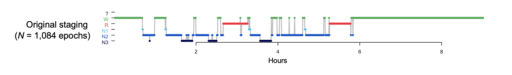{:width="100%"}


## Evaluating overal staging quality
   
The above hypnogram above _looks_ quite reasonable, albeit with a
relatively short sleep duration, i.e. TST is under five hours.
Although there are only two complete NREM
cycles, we see a typical hypnogram structure, with cycles containing
relatively more N3 sleep earlier in the night, and more REM sleep
later on.

But, can we be _more sure_ that it is in fact consistent with the
signal data and accurately reflects the night's sleep?  At an extreme,
the staging (or signal) data may have been corrupted or - especially
in the context of a study involving thousands of people - even
mislabelled on exporting, such that there is now no correspondence
between signals and staging files.  Alternatively, the staging may
simply be of very low quality/consistency.

The [`SOAP`](../ref/soap.md#soap) command (Single Observation
Accuracies and Probabilities) can partially address this type of scenario.  In
short, it takes as inputs one or more signals, as well as a set of "observed"
stages.  These will typically be for 30-second epochs staged manually, but
this need not be the case (e.g. they could be from some other automated predictor.)

By default, SOAP will:

 - perform epoch-level spectral analysis (and possibly extract other
   features) for one or more channels

 - apply a singular vector decomposition (SVD) to the
   epoch-by-frequency bin matrix (as described [here](../ref/psc.md))
   to extract a smaller number (e.g. 10) of orthogonal components,
   retaining only those that are significangtly correlated with the
   observed staging

 - fit a simple linear (or quadratic) discriminant analysis (LDA/QDA)
   to predict stage given the set of singular vectors

 - evaluate how well the signal data "predicts" the (known) stages,
   e.g. summarized as (for example) a kappa coefficient

!!! info
    The SOAP command requires existing stage annotation,
    i.e. similar to the `HYPNO` command.  That is, it does _not_ predict
    sleep stages from scratch.  In Luna, we'll see how this different task
    can be done using the [`POPS`](../ref/pops.md) command, as described below.


Under the _assumptions_ that a) the signal data contain sufficient
information to discriminate sleep stages and b) the observed stages
well reflect true changes in sleep stage, we'd expect a high kappa
coefficient.  That is, we expect to be able to build a self-contained
(N of 1) model that relates (spectral) features of the EEG (or other
signals) to sleep stages, as we know that sleep stages have generally
quite distinctive signatures in the EEG (i.e. it is this fact that enables
manual staging based on visual inspection of a raw EEG signal).

If the SOAP model results in a very low kappa (or other goodness of fit
metric), this may indicate gross mismatches between signals and
observed stages.  It is also important to remember that a very low
kappa may instead indicate that the particular signal chosen is very
artifact-ridden (e.g.  if SOAP analysis were based on a dirty C4-M1
channel, but the human stager also had access to a clean C3-M2
channel).

<h3>Running SOAP on the original data</h3>

We can run SOAP as follows, saving the output to the file `soap.db`:

```
luna s.lst -o soap.db -s SOAP

```

!!! hint "SOAP defaults"
    Although there are a number of parameters and models that can be specified differently, this invokes
    the default, single-channel form of this command, which by default expects a channel labelled `C4_M1` or
    similar.  If you wish to use a different - e.g. say `EEG_F3`, one quick approach is to use an [alias](../luna/args.md#aliases)
    to relabel `EEG_F3` as `C4_M1`:
    ```
    luna s.lst -o soap.db "alias=C4_M1|EEG_F3" -s SOAP
    ```
    (Alternatively, you can specify a new SOAP model for that channel, or for multiple other channels, but we won't cover that here.  Note
    that in this vignette, we've already made a new EDF with a channel labelled `C4_M1`.

Running the default version of SOAP we see the following output in the console:
```
  Confusion matrix: 5-level classification: kappa = 0.89, acc = 0.93, MCC = 0.89

           Obs: N1      N2      N3      R       W       Tot
  Pred: N1      0       1       0       0       0       0.00
        N2      6       281     10      2       15      0.29
        N3      0       12      74      0       2       0.08
        R       2       5       0       122     7       0.13
        W       2       4       0       6       533     0.50
        Tot:    0.01    0.28    0.08    0.12    0.51    1.00
```

The key measure is the _kappa_ cofficient - here it is 0.89 which is
high.  This is from a 5-class classification of sleep stages: N1, N2,
N3, R, W.   (If the study did not include one of these stages, SOAP automatically drops it;
the only requirement is that there are at least two stages with a minimum number of observations
to be able to fit the LDA/QDA).  Below these fit metrics, there is also a confusion matrix
for "predicted" versus observed epochs - in general, these tables
are probably not particularly informative for SOAP (unlike for true prediction in the POPS context, described below).

SOAP also outputs a similar kappa/matrix for the 3-class NREM/REM/wake classification:
```
  Confusion matrix: 3-level classification: kappa = 0.93, acc = 0.96, MCC = 0.93

           Obs: NR      R       W       Tot
  Pred: NR      384     2       17      0.37
        R       7       122     7       0.13
        W       6       6       533     0.50
        Tot:    0.37    0.12    0.51    1.00

```

This is also very high (K=0.93).  So far, so good - this seems
reassuring, but what would we expect if there _had_ of been a problem
with the staging?  We'll address that in the next sections, by artificially
introducing errors in the observed staging.


### Scrambled stage data

Let's start with an extreme case: completely scrambled staging data.
Perhaps the staging file was accidentally sorted by the wrong column
prior to output, etc.  These things can happen...


First we'll extract the observed stage information from the XML into a simpler text file (`obs.eannot`), with
one stage label per epoch), using the `STAGE` command in Luna, along with the `min` option, to give _minimalistic_ output (i.e.
just the stages written to the text file `obs.eannot`:
```
luna s.lst -s STAGE min > obs.eannot
```

Then we use the command-line `awk` utility to make it _completely_
random (i.e. by adding a random number as the first column, and then
sorting by that random number):

```
awk ' BEGIN { srand() } { print rand() , $0 } ' OFS="\t" obs.eannot | sort -n | cut -f2 > rnd.eannot
```

If we were to run SOAP with this (completely) random set of stages,
we'd expect a low (basically zero) kappa.  For convenience, we'll make
a new sample list `a.lst` that does not attach the original XML
staging (i.e. thereby letting us attach different staging information
for the same EDF).  Running `--build` without the `-nsrr` option will, in this case,
mean that the `-nsrr.XML` file extension is not recognized, and so no annotations are attached in the sample list (period as the third field):
```
luna --build . > a.lst
```
```
cat a.lst
```
```
shhs1-0000    ./shhs1-0000.edf      .
```
We can now explicitly attach the desired set of annotations/stages on the command line: this would replicate the original analysis:
```
luna a.lst -o soap1.db annot-file=obs.eannot -s SOAP epoch
```
In contrast, this swaps in the randomized set of stages (in `rnd.eannot`):
```
luna a.lst -o soap0.db annot-file=rnd.eannot -s SOAP epoch
```
We see the output from this analysis gives a very low kappa, as expected:
```
  Confusion matrix: 5-level classification: kappa = 0.02, acc = 0.52, MCC = 0.05
```

If we look at the stages observed (bottom row, one line is one epoch) versus the SOAP-based predictions (top row), we
see there is little correspondence.  In fact, most epochs have been predicted to be _wake_.   The precise predictions aren't of
particular interest here, in the context of a very low overall kappa - it simply means that the model was not able to find stage-relevant
information in the EEG (i.e. precisely because we scrambled it). 

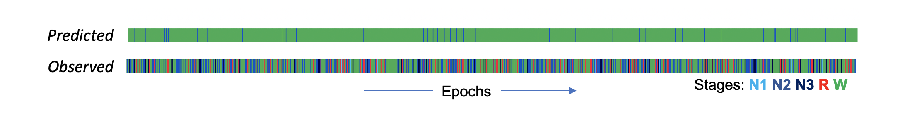{:width="100%"}

We can also look at the posterior probabilities as well as the most-likley stages under the SOAP model.  (The POPS output follows the same structure.)  Here we see the posteriors from the original SOAP analysis (i.e. with the true/observed staging).  Each line shows the probabilties "stacked" to sum to 1.0, for a given epoch.  In the real data, the predictions were "confident" in the sense that the maximum posterior was typically near 1.0.   In contrast, the completely scrambled data shows a very different pattern (note, the plots are sorted such that the most likely stage is plotted at the bottom):

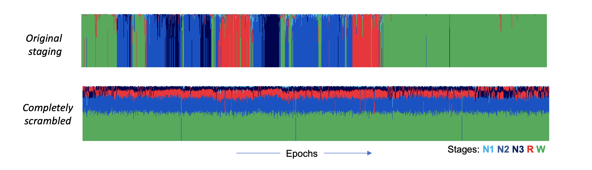{:width="100%"}

If you ever see this type of pattern (plus a low kappa), it is telling you there is little or no correspondence between signals and stages.

!!! hint
    In this (contrived) example, depending on the randomization
    of stages, it is possible that you don't even have a single SVD
    component that is associated with the stage data, in which case
    the LDA/QDA model will not be fit.  If this were to occur, you can
    make the inclusion of components more liberal by setting `pc` to a
    higher value, e.g. 0.2
    ```
    luna a.lst -o soap0.db annot-file=rnd.eannot -s SOAP epoch pc=0.2
    ```
    ```
      retaining 4 of 10 PSCs, based on ANOVA p<0.2
    ```
    This is only likley to happen in these contexts of completely corrupted studies - or perhaps if you are experimenting with other types of signals
    (other than the EEG) that might not always be expected to show very strong associations with sleep stages.
    
### Swapped files

In the previous example, any quick visual inspection of the obsreved
hypnogram (i.e. corresponding to the Observed stages plot above) would
indicate that the data are not consistent with a typical looking human
hypnogram, and so we wouldn't really need SOAP to tell us that.  What
if we did have stages that _looked_ densible, but did not align with
the individual on whom we have signal data though?  To see, here we
swap another person's staging in, and see what happens. i.e. here the stages in `other.eannot`
are from somebody else:
```
luna a.lst -o soap2.db annot-file=other.eannot -s SOAP epoch
```
The kappa is not zero, but it is markedly lower than the original:
```
Confusion matrix: 5-level classification: kappa = 0.29, acc = 0.55, MCC = 0.32
```

This certainly reflects some degree of _over-fitting_, whereby the LDA
is trying hard to find connections between the signals and stages.
This level of value is still a lot lower than what we'd expect
normally, however.   Here are the two hypnograms:

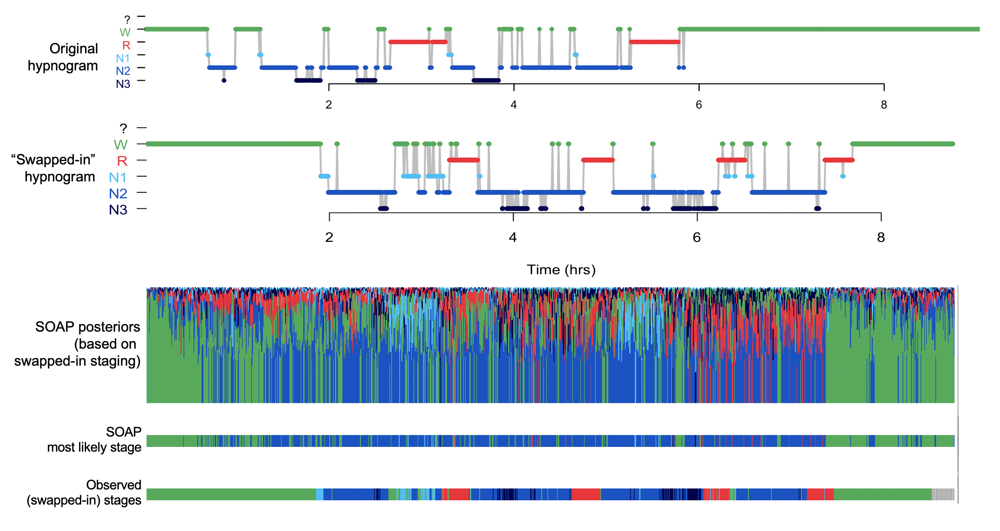

They are clearly different, but still, they are more similar than the
completely random set.  For example, both studies start and end in
quite long periods of wake.  This enables the model to achieve an
above-chance level of wake/sleep classification, perhaps, but again it
is nowhere near the level of performance we'd expect with real data:

To contextualize this result, here is a histogram of kappa values from
thousands of people in the SHHS (wave 1) -- values of kappa under 0.5
are very rare, and likley indicate (major) issues with the staging.
Most individuals have kappas of 0.8 or greater:

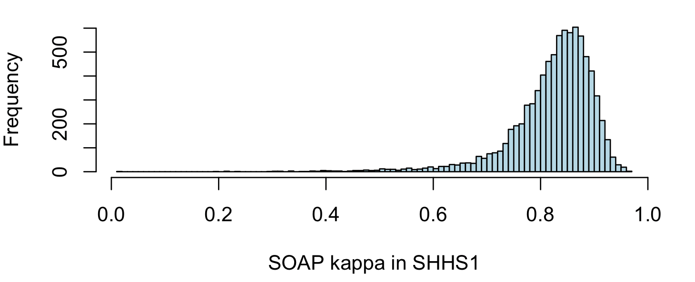

Remember that because SOAP fits and predicts on the same data, this kappa should not be interpreted in the same way
as a kappa from a true prediction context.   This just means the absolute values are calibrated differently.  Nonetheless, it
still is informative as to the quality of staging, as we show below.


### Stage completion

In some circumstances, SOAP can be used to "fill in" missing data from
a partially scored study ( (as long as a sufficient number of epochs
have been scored for each stage).  For example, going back to the original staging, let's pretend
that we only staged the first 600 epochs, here making a new file `inc.eannot` that is _incomplete_, placing
`?` symbols for all epochs past 600:
 
```
awk ' NR <= 600 { print $0 } NR > 600 { print "?" } ' obs.eannot > inc.eannot
```
Running SOAP on this set:
```
luna a.lst -o soap3.db annot-file=inc.eannot -s SOAP epoch
```
We still see high kappas (n.b. which relate only to the _non-missing_ part of the data):
```
Confusion matrix: 5-level classification: kappa = 0.87, acc = 0.92, MCC = 0.88
Confusion matrix: 3-level classification: kappa = 0.92, acc = 0.96, MCC = 0.92
```
and the console indicates that now many epochs are unstaged:
```
  final epoch counts: ?:484 N1:10 N2:275 N3:84 R:68 W:163
```
Based on the observed data, SOAP will effectively try to fill in the remaining, unstaged epchs: in this case, it
appears to do quite a good job:
```
# full original
k <- ldb( "soap1.db" )

# completed (missing after epoch 600)
m <- ldb( "soap3.db" )

par(mfcol=c(3,1) , mar=c(1,3,0.5,0.5) )
lhypno( k$SOAP$E$PRIOR )
lhypno( m$SOAP$E$PRIOR )
lhypno( m$SOAP$E$PRED )
```

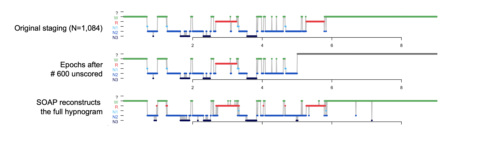{:width="100%"}


### Error correction

On the assumption that _most_ epochs have been correctly and
consistently assigned, we may expect a high kappa value from SOAP.
Under this scenario, we can then use SOAP in a different manner, to
potentially identify and correct a smaller number of inconsistencies
or errors in staging that may exist.

On the assumption of largely correct staging, SOAP confidence
scores/kappas can also provide a rough guide to signal quality. For
example, given multiple EEG channels, if some have very high kappas
but some have low kappas, the latter set may contain higher levels of
artifact, etc.

SOAP also generate _probabilistic stage assignments_ based on the
original categorical/discrete staging.  This may be useful, for
example, to restrict certain analyses only to _"high confidence"_
intervals, or to derive hypnogram statistics (e.g. stage duration)
based on probablistically-weighted epoch counts.  Although beyond the scope of
this vignette, this approach may better handle "mixed epochs", if the SOAP model
places weight on multiple stages.

That is, overall SOAP can be viewed in two ways: 1) as a tool to check the
consistency between signals & staging, 2) as a tool to manipulate/use
the existing staging, _on the assumption that stages and signals are
largely consistent_.

Here we consider a biased/inconsistent stager, who (for some strange reason) scores
every ninth epoch as REM.  We can simulate that as follows:

```
awk ' NR % 9 != 0 { print $0 } NR % 9 == 0 { print "R" } ' obs.eannot > err.eannot
```
Using SOAP to evaluate this error-containing set of stages `err.eannot`:

```
luna a.lst -o soap4.db annot-file=err.eannot -s SOAP epoch
```
We now see a kappa that is lower than the original (0.74 versus 0.89)
but still within a broadly _typical_ range:
```
  Confusion matrix: 5-level classification: kappa = 0.74, acc = 0.83, MCC = 0.75
```
In this case, if we pull out every ninth epoch, we can see that SOAP has almost always managed to correct
the mistakes that we introduced:  these tables show the posterior probabilities grouped by whatever
the original stage was for that epoch:

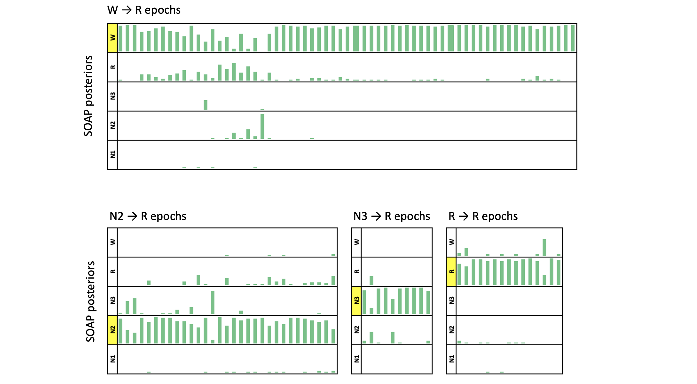{:width="100%"}

In this particular case, given a reasonably high kappa, we might do
well to accept these revised predictions over the original ones.  That
is, when SOAP changes the staging for an epoch, it is really saying
(for example): "although staged R, this epoch looks much more like
most of the other epochs labelled N3, than it does to most of the othe
epochs labelled R".  Naturally there is no guarantee that any changes
SOAP makes will always be the correct ones.  In some cases, it might
be more likley to make staging worse on average, not better -- this
will in large part depend on the (unknowable) type of data, and the
types/extent of staging errors made.  In future work, we plan to
evaluate empirically the conditions under which using SOAP may improve
staging quality, e.g. using correlations between known demographic
factors such as age, or test-retest reliability, as figures of merit
(assuming that more reliable staging will increase the strength of
statistical associations).

!!! hint
    New/revised SOAP stages can be obtained from the `PRED` column of the `E`-stratified output tables.

## Aligning orphaned stage data

The `PLACE` command implements a special case of using `SOAP` to align
staging with signal data.  Specifically, this addresses the scenario
where an EDF and a set of annotations differ in length, but one is not
sure how they should be aligned (i.e. does the list of annotations
necessarily start at the 0-second EDF start, or some other time)?
Although this may be considered a _niche_ case, we have come across
exactly this type of scenario more than once when working with legacy
datasets - e.g. as might happen if only parts of the night were
extracted fro much longer / 24-hour recordings, and the time-stamps
have been lost during the export process, with original datasets no
longer available.  (If nothing else, it is a nice proof-of-principle demonstration of the SOAP model.)

We'll again simulate this type of scenario, here extracting out only staging data from epoch 30 to 730 (i.e. 601 epochs,
whereas the full EDF/staging has 1084 epochs).
```
awk ' NR >= 30 && NR <= 730 ' obs.eannot > ex.eannot
```

The `PLACE` command is essentially a wrapper around `SOAP`, which
calls it multiple times, at all possible alignments of the staging and
signal data.  (The staging may be shorter, or longer, than the EDF
signals.) Graphically, this illustrates what `PLACE` is doing:

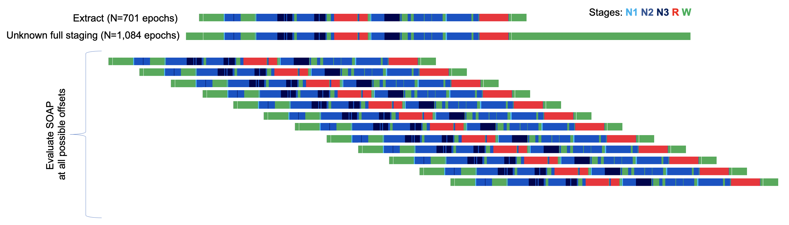{:width="100%"}

For every placement, it calculates the SOAP kappa, and then will, at the end, select the offset with the highest kappa
as the most likely placement.

We run `PLACE` as follows:
```
luna a.lst -o place.db -s PLACE stages=ex.eannot
```
As well as the required `stages` command, and some other specific options, this command takes the same options as the SOAP command (i.e.
this will assume a single-EEG model for `C4_M1` by default. 

```
destrat place.db +PLACE | behead
```
```
             K   0.86073512269087
        OFFSET   29
      OLAP_EDF   0.646678966789668
        OLAP_N   701
      OLAP_STG   1
```

Here we see the most liklely offset is `29`, which is the correct
answer (i.e. staging epooch `1` corresponds signal epoch `1+29 = 30`,
based on how we extracted the epochs above).  We can plot the kappa for
all possible alignments, to get a sense of how specific this placement was:
```
destrat place.db +PLACE -r OFFSET > o.1
```
And in R:
```
d <- read.table("o.1",header=T,stringsAsFactor=F)
plot( d$OFFSET , d$K , type="n" , xlab="Offset (epochs)" , ylab="Kappa" )
abline(v=c(0,29), col=c("gray","red") )
lines( d$OFFSET , d$K , type="l" ,  col="darkgreen" )
```

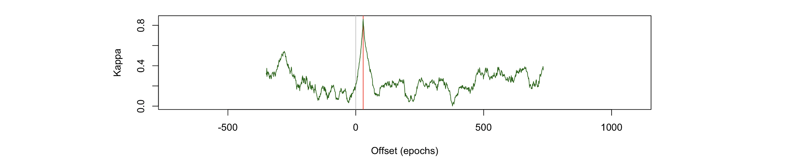{:width="100%"}

We see there really is quite a marked spike at the exact true offset.
Although it will depend on a number of factors, and there are
certaonly scenarios that could mislead `PLACE`, in general, with
reasonably typical inputs, the `PLACE` command appears to do a good
job of resolving alignments within a single epoch.

Of course, one might say: _why not just use an automated stager,
rather than trying to rescus partial, manual staging?_ This is also a
reasonable idea - we could do so with `POPS` below, for example.
However, there may be circumstances where the montages are very
different (e.g. only intracranial EEG leads, or from a wearable
device, or a non-human model system for which good staging models have
not been built).  If one is other confident in the quality of the
human staging, it still may be preferrable to automated staging, and
given it has already been performed, it makes sense to try to use it
if you can.


## Changing epoch durations

The SOAP model is not constrained to 30-second epochs.   In fact, you can easily change the
epoch size to obtain any desired epoch length: e.g. for 10-second epochs

```
luna s.lst -o out.db -s 'EPOCH dur=10 & SOAP epoch ' 
```

This will emit 3,252 stage predictions, rather than 1,084 (from the 30-second epoch).
However, in practice, one wants to ensure that the original epoch durations are an exact multiple
of any smaller epoch time used: if not (e.g.  specifying a 7-second epoch, but with original 30-second
staging), then some epochs may have more than one assigned stage.

However, with the `REBASE` variant of the SOAP command, it is also
possible to fit a model based on epoch features of one particular
duration, but then to make predictions at a second duration.  Thus enables
one to, for example, translate between 30-second and 20-second epoch durations,
or vice versa.  The key is that a third epoch length must be selected so that
both are exact multiples: e.g. 10 or 5 seconds.

For example, given original 30-second staging, this builds a SOAP model
of the signal-stage relationships based on 5-second sub-epochs, but then uses
that to predict given features based on 20-epochs of the same data:
```
luna s.lst -o out.db -s 'EPOCH dur=5 & REBASE dur=20'
```

This command may have some utility if working with studies based on
European/US 20/30-second staging conventions, but you wish to
harmonize them.   As noted above, simply running automated staging with the desired epoch
duration is also an option, e.g. using `POPS`.

Here we see posterior probability plots for a range of rebased epoch durations:

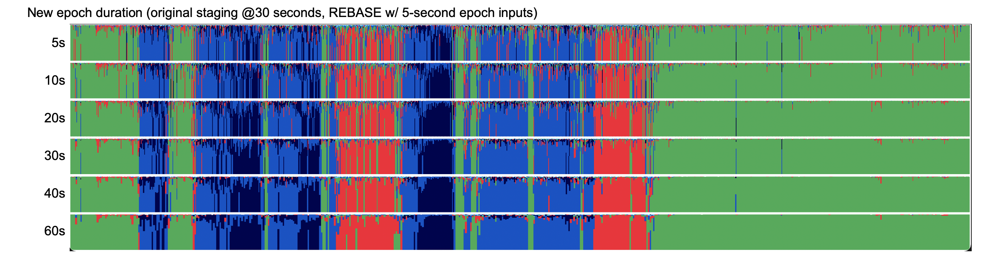{:width="100%"}


## Prediction with POPS

Finally, instead of seeding analysis on observed staging, we can
predict stages from scratch, given a model based on _other_ PSGs.
This is what the `POPS` command does.

!!! info "LGBM & POPS development" 
    POPS implements feature-based prediction using Microsoft's
    [LightGBM](https://lightgbm.readthedocs.io/) gradient descent boosting machine library.
    The POPS command is conceptually similar to Raphael Vallat's
    excellent [YASA](https://raphaelvallat.com/yasa/build/html/index.html) Python-based
    stager, which also uses LightGBM although with slightly different
    feature sets.  (FWIW, in work to be described more fully, we've
    found average performance to be broadly comparable between POPS
    and YASA - although perhaps interestingly, the kappas from the two
    models are often not very strongly correlated,
    suggesting there may be room for improvement, i.e. if the two
    implementations tend to have different failure modes...

### Single-channel EEG model

Fully detailing this model, its variations, and the procedure for
training models is beyond the scope of this vignette.  Here, we merely
show performance for this one SHHS individual, using a _beta-version_
of the vanilla single-EEG model.  The only requirement is a central
EEG (or equivalent) channel labelled `C4_M1` (you can use the `alias`
options as noted above).

This library (`m1`) is available for download at this [Dropbox
link](https://www.dropbox.com/s/lha9ibincmvpod3/m1.zip?dl=0).  This is
a ZIP file (13MB) called `m1.zip`.  After downling, expanding it will
result in a folder called `m1` (_model 1_). You then will run `POPS`
using `lib` to specify the model root (`m1`) and `path` to point to
this folder (e.g. `~/working/sleep/pops/m1` or wherever you saved it).

The `m1.ftr` file defines the set of _features_ extracted per epoch,
upon which the model is trained.  Naturally, this is also necessary
when using the model for prediction, as Luna needs to be able to
derive the same set of features in new data.  The details aren't
important here, but this is the current prototype version of the
default single-EEG model:

```
% --------------------------------------------------------------------------------
%
% Declare any channels used (required), sample rates
%
% --------------------------------------------------------------------------------

CH C4_M1 C4 C4.M1 C4-M1 C4.A1 C4_A1 C4-A1 128 uV

% --------------------------------------------------------------------------------
%
% Level 1 features
%  block : feature {key=value key=value}
%
% --------------------------------------------------------------------------------

% full power spectra, up to 30 Hz 
spec1:  SPEC  C4_M1  lwr=0.5 upr=30
vspec1: VSPEC C4_M1  lwr=0.5 upr=30

% bands (relative band power)
rband1: RBAND C4_M1

% alternate metrics

misc1: HJORTH   C4_M1
misc1: SKEW     C4_M1
misc1: KURTOSIS C4_M1

misc2: FD       C4_M1
misc2: PE from=5 to=5  C4_M1

% indiv-level covariates, if available 

demo1: COVAR age male

% --------------------------------------------------------------------------------
%
% Epoch/row exclusions based on level-1 features
%
% --------------------------------------------------------------------------------

misc1: OUTLIERS th=8

% --------------------------------------------------------------------------------
%
% Level 2 features: 
%  to-block: feature block=from-block {key=value}
%
% --------------------------------------------------------------------------------

% SVD - in trainer model, writes this to myfile.txt (based on all individuals) 

spec1.svd:  SVD block=spec1 nc=8 file=m1.spec1.svd
vspec1.svd: SVD block=vspec1 nc=4 file=m1.vspec1.svd

% temporal smoothing
spec1.svd.smoothed: SMOOTH block=spec1.svd half-window=15
spec1.svd.denoised: DENOISE block=spec1.svd lambda=0.5

rband1.smoothed: SMOOTH block=rband1 half-window=15
rband1.denoised: DENOISE block=rband1 lambda=0.5

misc1.smoothed: SMOOTH block=misc1 half-window=15
misc1.denoised: DENOISE block=misc1 lambda=0.5

misc2.smoothed: SMOOTH block=misc2 half-window=15
misc2.denoised: DENOISE block=misc2 lambda=0.5

time1: TIME order=1

rband.deriv: DERIV block=rband1 half-window=20
spec1.svd.smoothed.deriv: DERIV block=spec1.svd.smoothed half-window=20


% --------------------------------------------------------------------------------
%
% Final feature selection (blocks as defined above)
%
% --------------------------------------------------------------------------------

SELECT demo1 rband1 misc1 misc2 spec1.svd vspec1.svd
   spec1.svd.smoothed spec1.svd.denoised rband1.smoothed rband1.denoised
   misc1.smoothed misc1.denoised misc2.smoothed misc2.denoised time1
   rband.deriv spec1.svd.smoothed.deriv

```

### Running POPS 

To run `POPS`, just invoke:
```
luna s.lst -o pops.db -s POPS path=~/dropbox/pops/m1 lib=m1
```
where `path` points to where you downloaded the `m1` folder (see above).

This should finish quickly - it typically takes around 2 seconds to fully stage a study.  If the signal is
of a different sample rate, Luna will first resample to obtain a 128 Hz signal. 

!!! hint "POPS and LGBM support"
    If you try to run `POPS` or similar commands and see the following:
    ```
    error : no LGBM support compiled in
    ```
    this means you need to obtain a different version of Luna, or explicitly compile it with the
    [LightGBM](https://lightgbm.readthedocs.io/) library linked in.  See [here](../download/source.md) for details.


If manual staging was available, Luna will calculate kappa statistics and a confusion matrix.  (Note: unlike SOAP,
any original staging information is not used in any of the calculations/predictions; it is only included to evaluate model performance, when
the "true" answers are known):

```
  kappa = 0.897767; 3-class kappa = 0.940477 (n = 1082 epochs)

Confusion matrix: 
        Pred:    W       R       N1       N2       N3        Tot
  Obs: W       528       0       14       14        0       0.51
       R         4     124       0         2        0       0.12
       N1        0       0       1         9        0       0.01
       N2        1       3       1       290        7       0.28
       N3        0       0       0        16       68       0.08
       Tot:   0.49    0.12    0.01      0.31     0.07       1.00
```

Here we see a very high of almost 0.9 for the 5-class solution.
Correspondingly, the confusion matrix shows very little evidence of
much confusion in these stage assignments.

Human-human inter-rater reliability in staging is typically only
around kappa ~0.8, so these types of results definitely reflect an
upper-bound on how good we'd expect a stager to be.  We're in the
process of evaluating, but in general POPS has good performance, with
a typical kappa of around 0.8 for the 5-class problem, and higher for
the 3-class problem.  The exact parameters of performance will of
course always depend on a host of factors - especially when applied to
studies from completely different cohorts than used in the training of
the model.  (This particular SHHS individual was not used in model
training, although other SHHS individuals were.)  For future
development, we are most focused on making the predictions more
_robust_ (in the sense of trying to avoid doing very poorly, even when
in principle the signal data are sufficient), rather than trying to
add one or two percentage points to the (already high) average kappa
values.   A full description of the approach - and various extensions to it
under development - will be detailed in future updates. 

The key metrics are available in the output databases (some rows omitted for clarity):

```
destrat pops.db +POPS | behead
```
```
             ACC   0.934380776340111
            ACC3   0.964879852125693
            CONF   0.892255280246547
               K   0.897767498309929
              K3   0.940476638571775
             MCC   0.898677254612086
            MCC3   0.941308923450242
     REM_LAT_OBS   118.5
     REM_LAT_PRD   124
     SLP_LAT_OBS   41
     SLP_LAT_PRD   36.5
```

The confusion matrix from the console can also be extracted (although note the wonky row/col ordering here):
```
destrat pops.db +POPS -r OBS -c PRED -v N
```
```
ID            OBS    N.PRED_N1  N.PRED_N2  N.PRED_N3  N.PRED_R   N.PRED_W
shhs1-0000    W      14         14         0          0          528
shhs1-0000    R      0          2          0          124        4
shhs1-0000    N1     1          9          0          0          0
shhs1-0000    N2     1          290        7          3          1
shhs1-0000    N3     0          16         68         0          0
```

Summary statistics such as stage durations based either one counts of the most likely epoch (`PR1`) or a weighted estimate
(`PRF`) can be obtained under the `SS` stratum:

```
destrat pops.db +POPS -r SS -p 3
```
```
ID            SS      F1      OBS     ORIG    PR1     PREC    PRF     RECALL
shhs1-0000    W       0.970   278.000 278.500 266.500 0.991   255.314 0.950
shhs1-0000    R       0.965   65.000  65.000  63.500  0.976   61.512  0.954
shhs1-0000    N1      0.077   5.000   5.000   8.000   0.062   27.338  0.100
shhs1-0000    N2      0.916   151.000 151.500 165.500 0.876   161.227 0.960
shhs1-0000    N3      0.855   42.000  42.000  37.500  0.907   35.610  0.810
shhs1-0000    ?       NA      1.000   0.000   1.000   NA      1.000   NA
```

Finally, the raw epoch-level predictions can be obtained as follows (`PRED`):

```
destrat pops.db +POPS -r E -p 3
```
```
ID            E  CONF    FLAG    PP_N1   PP_N2   PP_N3   PP_R    PP_W    PRED    PRIOR
shhs1-0000    1  0.998   0.000   0.002   0.001   0.000   0.000   0.998   W       W
shhs1-0000    2  0.996   0.000   0.003   0.001   0.000   0.000   0.996   W       W
shhs1-0000    3  0.999   0.000   0.001   0.001   0.000   0.000   0.999   W       W
shhs1-0000    4  0.997   0.000   0.002   0.000   0.000   0.000   0.997   W       W
shhs1-0000    5  0.998   0.000   0.002   0.000   0.000   0.000   0.998   W       W
shhs1-0000    6  0.996   0.000   0.002   0.002   0.000   0.000   0.996   W       W
shhs1-0000    7  0.997   0.000   0.001   0.001   0.000   0.000   0.997   W       W
shhs1-0000    8  0.997   0.000   0.002   0.001   0.000   0.000   0.997   W       W
shhs1-0000    9  0.996   0.000   0.002   0.002   0.000   0.000   0.996   W       W
...
```

Using lunaR, we can plot the observed and POPS-predicted hypnograms:

```
k <- ldb("pops.db")
> par(mfrow=c(2,1))
> lhypno( k$POPS$E$PRIOR )
> lhypno( k$POPS$E$PRED )
```

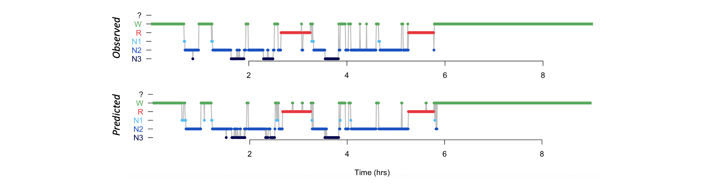{:width="100%"}

We can also plot the posterior probabilities, in the same way we did for SOAP.   Here we'll also output the multi-taper
spectrogram for visual reference:  i.e. we separately extracted that here: 

```
luna a.lst -t mtm -s MTM sig=C4_M1 nw=15 epoch
```
And load in in R:
```
d <- read.table( "mtm/shhs1-0000/MTM_F_CH_SEG.txt.gz" , header=T, stringsAsFactors=F )
```

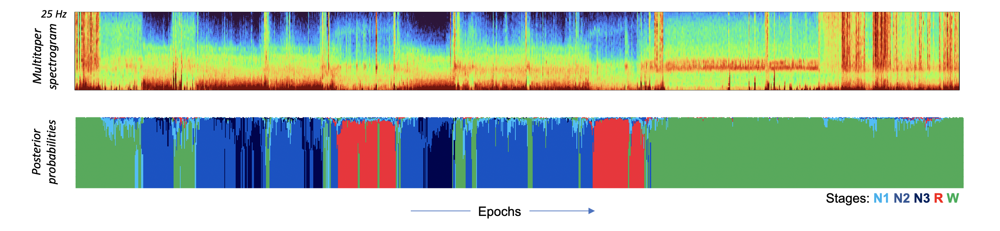{:width="100%"}


## Conclusion

This was an introduction to some of the logic and potential
applications of the SOAP (stage evaluation) command, as well as a
quick skim of the POPS command for staging, currently in the context
of a single-channel EEG.   We'll be posting updates to the model syntax, options
and newly trained models in the near future... Stay tuned!


